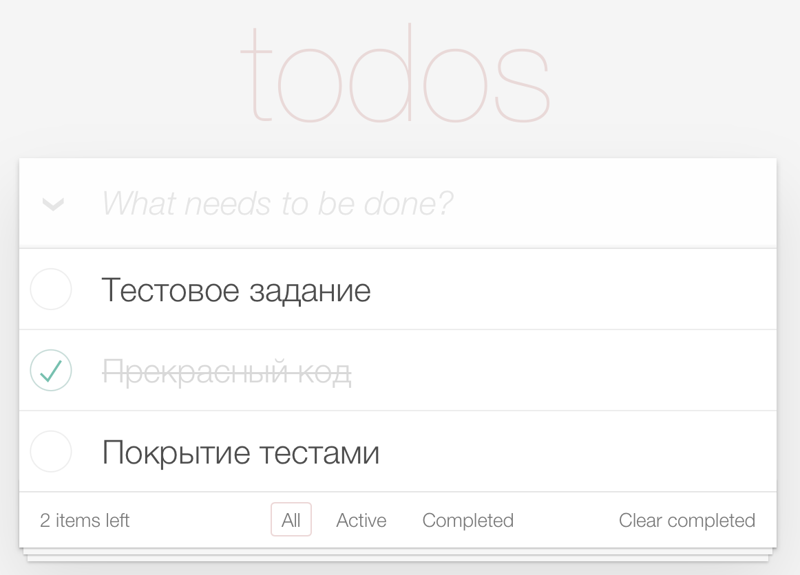

# Приложение «Todo»

Приложение ToDo, позволяющее управлять текущим списком дел.

Что должно быть в интерфейсе:

- поле для ввода новой задачи
- списки всех задач, невыполненных и выполненных задач (по отдельности)

Пример внешнего вида приложения:

  
#### Требования к коду:
- приложение создано с использованием TypeScript, React и React Hooks
- библиотеки компонент – на ваше усмотрение
- ключевая на ваш взгляд функциональность обязательно покрыта тестами
- проект должен запускаться командой npm i && npm run start
- опционально: проект доступен на GitHub Pages/Vercel/etc.

---